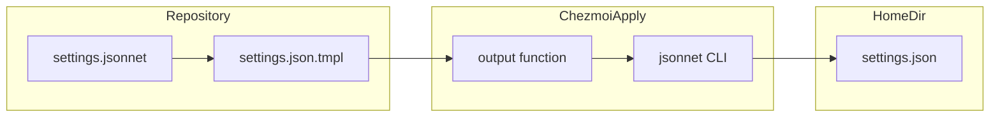
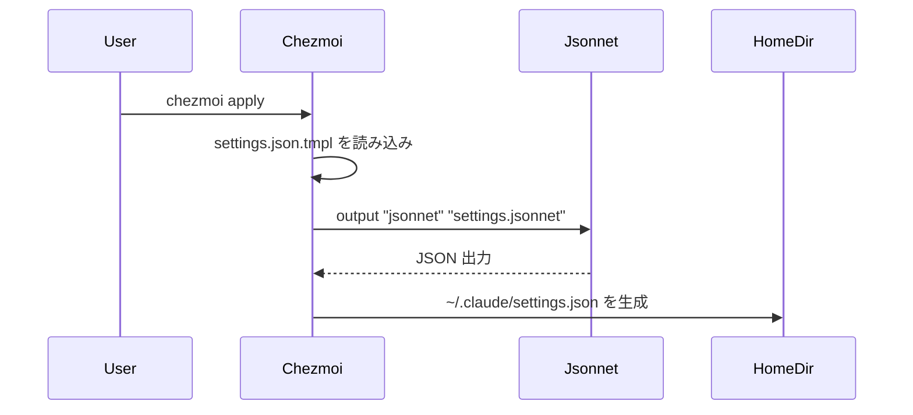
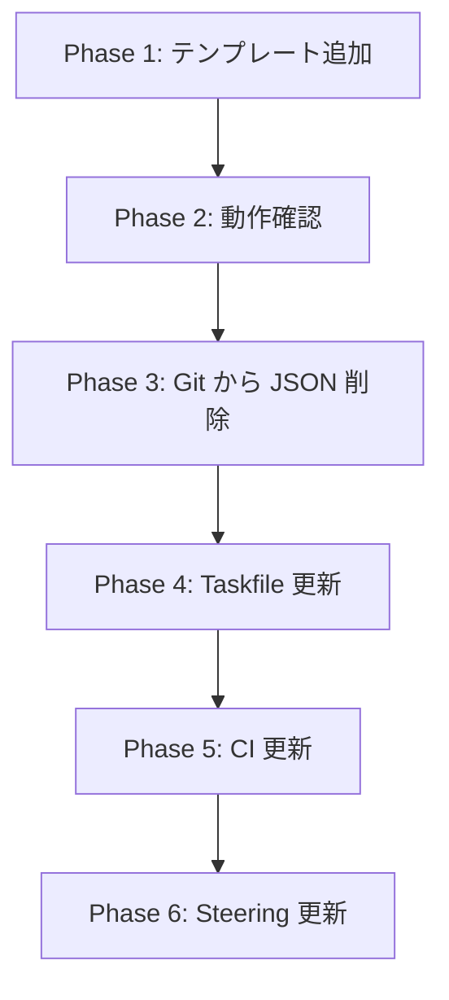

# Design Document: jsonnet-cleanup

## Overview

**Purpose**: 本機能は、dotfiles リポジトリにおける Jsonnet から生成される JSON ファイルの冗長なコミットを解消し、chezmoi の `output` テンプレート関数を活用して JSON ファイルを動的に生成する仕組みに移行する。

**Users**: dotfiles 管理者および利用者は、Jsonnet ソースのみを管理し、`chezmoi apply` 実行時に JSON ファイルが自動生成される。

**Impact**: 現在の Taskfile による事前生成から chezmoi によるオンデマンド生成への移行により、リポジトリ構造がシンプル化し、ソースと生成物の二重管理が解消される。

### Goals

- Jsonnet ソースファイルのみを Git 管理対象とする
- `chezmoi apply` 実行時に JSON ファイルを自動生成する
- Taskfile から不要な JSON 生成タスクを削除する
- CI ワークフローの整合性を維持する

### Non-Goals

- Jsonnet ファイル自体の内容変更
- 他の自動生成ファイル（mise.lock, aqua-checksums.json）の管理方法変更
- chezmoi 以外のツールへの移行

## Architecture

### Existing Architecture Analysis

現在のアーキテクチャ:
- `dot_claude/settings.jsonnet` → `task generate` → `dot_claude/settings.json` → `chezmoi apply` → `~/.claude/settings.json`
- Jsonnet ソースと生成された JSON の両方が Git リポジトリに存在
- `.chezmoiignore` で `*.jsonnet` ファイルはホームディレクトリへのコピーから除外済み

### Architecture Pattern & Boundary Map



**Architecture Integration**:
- Selected pattern: chezmoi テンプレートによるオンデマンド生成
- Domain boundaries: Jsonnet ソース管理（リポジトリ）と JSON 生成（chezmoi apply 時）の分離
- Existing patterns preserved: chezmoi テンプレート機能の活用
- New components rationale: `.json.tmpl` ファイルによる `output` 関数の活用
- Steering compliance: 宣言的管理、自動化優先の原則に準拠

### Technology Stack

| Layer | Choice / Version | Role in Feature | Notes |
|-------|------------------|-----------------|-------|
| Configuration | chezmoi | テンプレート展開と output 関数による外部コマンド実行 | 既存ツール |
| CLI | jsonnet | Jsonnet から JSON への変換 | mise 管理 |
| Automation | Taskfile | 残存タスク（mise.lock, aqua-checksums）の管理 | generate タスク削除 |
| CI | GitHub Actions | Jsonnet 構文チェック | check タスク更新 |

## System Flows

### chezmoi apply による JSON 生成フロー



## Requirements Traceability

| Requirement | Summary | Components | Interfaces | Flows |
|-------------|---------|------------|------------|-------|
| 1.1 | Jsonnet ソースのみ Git 管理 | Git, .gitignore | - | - |
| 1.2 | 生成 JSON を Git から除外 | Git, .gitignore | - | - |
| 1.3 | untracked 表示回避 | .gitignore | - | - |
| 2.1 | claude settings.json 自動生成 | settings.json.tmpl | output function | apply flow |
| 2.2 | claude .mcp.json 自動生成 | dot_mcp.json.tmpl | output function | apply flow |
| 2.3 | gemini settings.json 自動生成 | settings.json.tmpl | output function | apply flow |
| 2.4 | 生成結果の同一性 | Jsonnet | - | - |
| 3.1 | generate タスク対象除外 | Taskfile.yaml | - | - |
| 3.2 | generate タスク削除 | Taskfile.yaml | - | - |
| 3.3 | check タスク更新 | Taskfile.yaml | - | - |
| 4.1 | CI で JSON 存在を前提としない | ci.yaml | - | - |
| 4.2 | Jsonnet 構文チェック継続 | ci.yaml | - | - |
| 4.3 | 構文エラー検出 | ci.yaml | jsonnet lint | - |

## Components and Interfaces

| Component | Domain/Layer | Intent | Req Coverage | Key Dependencies | Contracts |
|-----------|--------------|--------|--------------|------------------|-----------|
| settings.json.tmpl (claude) | Config/Template | chezmoi apply 時に JSON 生成 | 2.1 | jsonnet CLI (P0) | Template |
| dot_mcp.json.tmpl | Config/Template | chezmoi apply 時に .mcp.json 生成 | 2.2 | jsonnet CLI (P0) | Template |
| settings.json.tmpl (gemini) | Config/Template | chezmoi apply 時に JSON 生成 | 2.3 | jsonnet CLI (P0) | Template |
| .gitignore | Config/VCS | 生成 JSON の Git 追跡除外 | 1.1, 1.2, 1.3 | - | - |
| Taskfile.yaml | Automation | generate タスク削除、check 更新 | 3.1, 3.2, 3.3 | - | - |
| ci.yaml | CI | Jsonnet 構文チェック | 4.1, 4.2, 4.3 | jsonnet CLI (P0) | - |

### Config/Template

#### settings.json.tmpl (claude)

| Field | Detail |
|-------|--------|
| Intent | chezmoi の output 関数で jsonnet を実行し settings.json を生成 |
| Requirements | 2.1, 2.4 |

**Responsibilities & Constraints**
- chezmoi apply 時に jsonnet CLI を呼び出す
- 生成される JSON は現行の `task generate` と同一の結果
- jsonnet CLI がインストールされていることが前提

**Dependencies**
- External: jsonnet CLI - Jsonnet から JSON への変換 (P0)
- External: chezmoi - テンプレート展開と output 関数実行 (P0)

**Contracts**: Template [x]

##### Template Contract

```gotemplate
{{ output "jsonnet" (joinPath .chezmoi.sourceDir "dot_claude/settings.jsonnet") -}}
```

- Preconditions: jsonnet CLI が PATH に存在すること
- Postconditions: 有効な JSON が標準出力される
- Invariants: Jsonnet ソースが有効な構文であること

**Implementation Notes**
- Integration: `joinPath` で chezmoi ソースディレクトリからの相対パスを解決
- Validation: Jsonnet 構文エラーは chezmoi apply 時にエラーとして表示される
- Risks: jsonnet CLI が未インストールの場合、apply 失敗

#### dot_mcp.json.tmpl

| Field | Detail |
|-------|--------|
| Intent | chezmoi の output 関数で jsonnet を実行し .mcp.json を生成 |
| Requirements | 2.2, 2.4 |

**Responsibilities & Constraints**
- settings.json.tmpl と同様の責務
- ファイル名が `dot_` プレフィックスにより `.mcp.json` に展開される

**Dependencies**
- External: jsonnet CLI (P0)
- External: chezmoi (P0)

**Contracts**: Template [x]

##### Template Contract

```gotemplate
{{ output "jsonnet" (joinPath .chezmoi.sourceDir "dot_claude/dot_mcp.jsonnet") -}}
```

#### settings.json.tmpl (gemini)

| Field | Detail |
|-------|--------|
| Intent | chezmoi の output 関数で jsonnet を実行し gemini の settings.json を生成 |
| Requirements | 2.3, 2.4 |

**Dependencies**
- External: jsonnet CLI (P0)
- External: chezmoi (P0)

**Contracts**: Template [x]

##### Template Contract

```gotemplate
{{ output "jsonnet" (joinPath .chezmoi.sourceDir "dot_gemini/settings.jsonnet") -}}
```

### Config/VCS

#### .gitignore 更新

| Field | Detail |
|-------|--------|
| Intent | 生成される JSON ファイルを Git 追跡から除外 |
| Requirements | 1.1, 1.2, 1.3 |

**Responsibilities & Constraints**
- `dot_claude/settings.json`, `dot_claude/dot_mcp.json`, `dot_gemini/settings.json` を除外
- 既存の Jsonnet ソースは引き続き追跡対象

**Implementation Notes**
- Integration: 既存の .gitignore に追記
- Validation: `git status` で untracked として表示されないことを確認

### Automation

#### Taskfile.yaml 更新

| Field | Detail |
|-------|--------|
| Intent | generate タスクの削除と check タスクの更新 |
| Requirements | 3.1, 3.2, 3.3 |

**Responsibilities & Constraints**
- `generate-claude-settings` タスクを削除
- `generate` タスク自体を削除（他の Jsonnet 処理がないため）
- `default` タスクから `generate` 依存を削除
- `check` タスクから JSON ファイルの diff チェックを除外

**Implementation Notes**
- Integration: 既存の lock 系タスクはそのまま維持
- Risks: 既存のワークフローで `task generate` を使用している場合は更新が必要

### CI

#### ci.yaml 更新

| Field | Detail |
|-------|--------|
| Intent | Jsonnet 構文チェックの実装と JSON diff チェックの除外 |
| Requirements | 4.1, 4.2, 4.3 |

**Responsibilities & Constraints**
- `task check` の変更に追従
- Jsonnet ファイルの構文チェックを追加
- 生成 JSON の存在を前提としない

**Implementation Notes**
- Integration: `jsonnetfmt --test` で構文検証（フォーマット一貫性も同時に検証）
- Validation: Jsonnet 構文エラー時に CI 失敗
- Command: `jsonnetfmt --test dot_claude/*.jsonnet dot_gemini/*.jsonnet`

## Data Models

本機能ではデータモデルの変更はない。ファイル構造の変更のみ。

### File Structure Changes

**Before**:
```
dot_claude/
  settings.jsonnet    # Jsonnet ソース
  settings.json       # 生成された JSON (Git 管理)
  dot_mcp.jsonnet     # Jsonnet ソース
  dot_mcp.json        # 生成された JSON (Git 管理)
dot_gemini/
  settings.jsonnet    # Jsonnet ソース
  settings.json       # 生成された JSON (Git 管理)
```

**After**:
```
dot_claude/
  settings.jsonnet    # Jsonnet ソース (Git 管理)
  settings.json.tmpl  # chezmoi テンプレート (Git 管理)
  dot_mcp.jsonnet     # Jsonnet ソース (Git 管理)
  dot_mcp.json.tmpl   # chezmoi テンプレート (Git 管理)
dot_gemini/
  settings.jsonnet    # Jsonnet ソース (Git 管理)
  settings.json.tmpl  # chezmoi テンプレート (Git 管理)
```

## Error Handling

### Error Strategy

chezmoi apply 時のエラーハンドリングは chezmoi の標準機能に委譲する。

### Error Categories and Responses

**User Errors**:
- jsonnet CLI 未インストール → エラーメッセージで mise install を案内
- Jsonnet 構文エラー → chezmoi が jsonnet のエラー出力を表示

**System Errors**:
- jsonnet 実行タイムアウト → chezmoi のデフォルトタイムアウト設定に従う

### Monitoring

- CI での Jsonnet 構文チェックによる事前検証
- `chezmoi apply --verbose` でデバッグ出力

## Testing Strategy

### Unit Tests

- Jsonnet ファイルの構文検証: `jsonnet --check *.jsonnet`
- テンプレートファイルの構文検証: `chezmoi execute-template`

### Integration Tests

- `chezmoi apply --dry-run`: テンプレート展開の確認
- `chezmoi diff`: 生成される JSON の差分確認
- 生成 JSON と現行 JSON の比較: 移行時の同一性検証

### E2E Tests

- 新規環境での `chezmoi apply`: JSON ファイルが正しく生成されることを確認
- Jsonnet ソース変更後の `chezmoi apply`: 変更が反映されることを確認

## Migration Strategy



### Phase 1: テンプレートファイル追加
- `.json.tmpl` ファイルを作成
- 既存の JSON ファイルは一時的に維持

### Phase 2: 動作確認
- `chezmoi apply --dry-run` で生成結果を確認
- 既存 JSON との差分がないことを検証

### Phase 3: Git から JSON 削除
- .gitignore に除外パターンを追加
- `git rm --cached` で JSON ファイルを Git から削除

### Phase 4: Taskfile 更新
- generate タスクを削除
- check タスクから JSON diff チェックを除外

### Phase 5: CI 更新
- Jsonnet 構文チェックを追加
- `task check` の変更に追従

### Phase 6: ステアリング文書更新
- `.kiro/steering/structure.md` の更新
- 旧記述: `Task ランナーで自動変換: task generate`
- 新記述: `chezmoi テンプレート（settings.json.tmpl）による動的生成`

### Rollback Triggers
- chezmoi apply が失敗する場合
- 生成 JSON の内容が期待と異なる場合

### Validation Checkpoints
- 各 Phase 完了後に `chezmoi apply` が成功することを確認
- CI が正常に通過することを確認

## Supporting References

### chezmoi output 関数

chezmoi の `output` テンプレート関数は外部コマンドを実行し、その標準出力をテンプレート展開結果として使用する。

```gotemplate
{{ output "command" "arg1" "arg2" }}
```

参考: [output - chezmoi](https://www.chezmoi.io/reference/templates/functions/output/)

### joinPath 関数

chezmoi ソースディレクトリからの相対パスを構築する際に使用。

```gotemplate
{{ joinPath .chezmoi.sourceDir "path/to/file" }}
```

参考: [Templating - chezmoi](https://www.chezmoi.io/user-guide/templating/)
