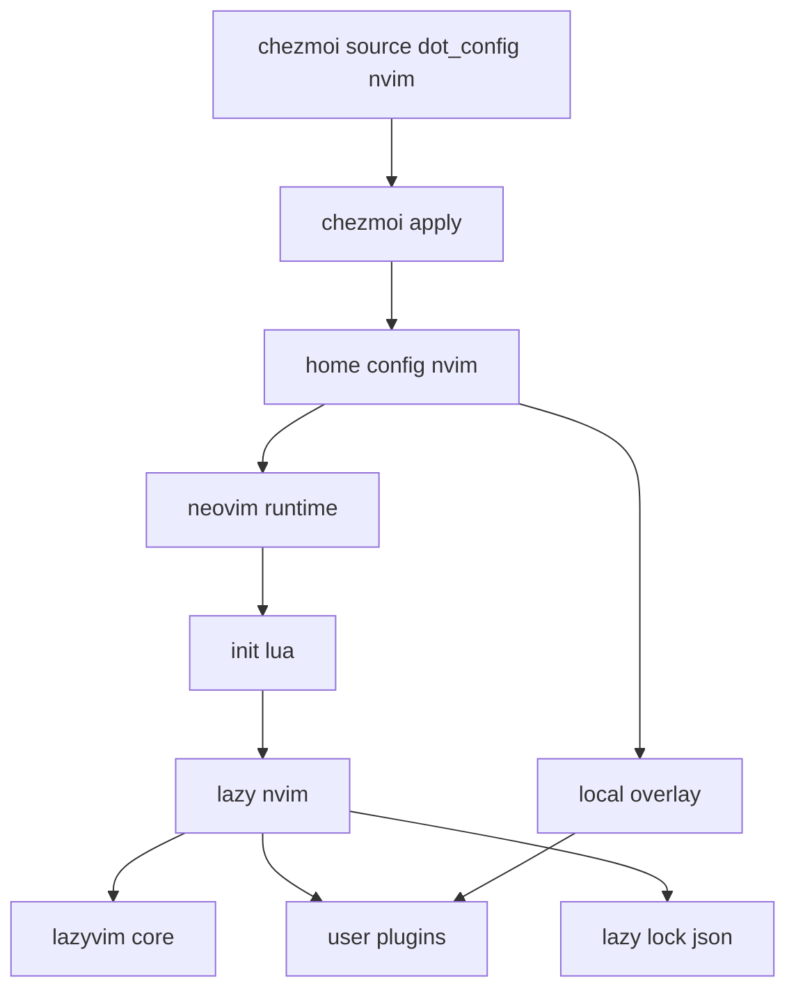
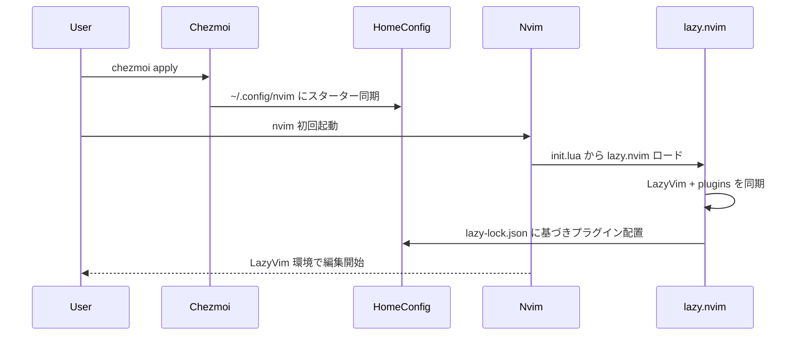

# Technical Design: lazyvim-chezmoi-config

## Overview
本機能は、chezmoi で管理している Neovim 設定に LazyVim を統合し、新規マシンや新規環境におけるエディタセットアップ時間を最小化する。LazyVim が提供する標準スターター構成をリポジトリへ取り込み、chezmoi apply により `~/.config/nvim` を宣言的に同期することで、導入と更新の冪等性を確保する。

対象ユーザーは本 dotfiles を利用する開発者（主に macOS / Linux 環境）であり、どの OS でも同一の LazyVim 体験を得られることを目的とする。OS 固有のパスや挙動は chezmoi のテンプレート分岐で吸収し、LazyVim 側の構成は upstream に極力追従する。

既存の VimScript ベース設定（`init.vim.tmpl`）から LazyVim 標準の Lua エントリポイントへ移行し、必要最小限の既存設定を LazyVim の `lua/config/*` に再配置する。ユーザー固有のローカルカスタムは chezmoi 管理外の専用領域に分離し、反復適用でも保持される。

### Goals
- `chezmoi apply` のみで LazyVim 構成が展開され、初回 Neovim 起動時にプラグインが自動インストールされること（1.1, 1.2）。
- 反復適用時も設定の整合性を保ち、ユーザーのローカルカスタムが失われないこと（2.1〜2.4, 4.4）。
- macOS と Linux の両環境で同一構成が動作し、必要な OS 依存設定のみ分岐できること（3.1〜3.3）。
- 既存 dotfiles の chezmoi 命名/配置規約に沿った構造で管理されること（4.1〜4.3）。
- LazyVim スターター構成と Neovim 互換性（v0.11.5 ピン）を満たすこと（5.1〜5.4）。

### Non-Goals
- Nerd Font、Node.js、ripgrep、clipboard ツール等、LazyVim の推奨システム依存の自動導入。
- LazyVim upstream の自動追従・自動マイグレーション（更新は運用手順で対応）。
- 既存 `init.vim` の全設定の 1:1 互換移行（必要最小限の移植に留める）。

## Architecture

### Existing Architecture Analysis
- 現状 `dot_config/nvim/` 配下には `init.vim.tmpl` のみが存在し、プラグイン管理や Lua ベースの構成は導入されていない。
- Neovim 本体は aqua により `neovim/neovim@v0.11.5` がピン留めされており、LazyVim の要求バージョン（0.11.2+）を満たす。
- OS 依存の設定は、他のアプリ設定と同様に `.tmpl` で分岐する既存パターンがある。

### Architecture Pattern & Boundary Map
選択パターンは「**Vendored LazyVim Starter + Local Overlay（設定レイヤリング）**」である。LazyVim の公式スターターをリポジトリに vendoring し、chezmoi が管理する “上流準拠レイヤ” と、ユーザーが自由に追加する “ローカルレイヤ” を明確に分離する。

**Architecture Integration**:
- Selected pattern: Vendored starter + overlay。upstream 乖離を抑えつつ、ローカル変更の保持を容易にする。
- Domain/feature boundaries:
  - **Upstreamレイヤ**: LazyVim スターター由来の構成（chezmoi 管理対象）。
  - **Overlayレイヤ**: ユーザー固有のローカルカスタム（chezmoi 管理外）。
  - **Templateレイヤ**: OS/環境依存分岐のみを `.tmpl` で注入。
- Existing patterns preserved: `dot_config/` 配下での chezmoi 管理、`.tmpl` による最小限の分岐。
- New components rationale: Lua エントリポイント採用、ロックファイル固定、ローカル分離のための構造追加が必要。
- Steering compliance: 既存の dotfiles 構造、冪等適用、環境差分のテンプレート吸収に準拠。

### Technology Stack

| Layer | Choice / Version | Role in Feature | Notes |
|-------|------------------|-----------------|-------|
| Runtime / CLI | Neovim v0.11.5 (aqua) | LazyVim の実行基盤 | LazyVim 要件 0.11.2+ を満たす |
| Plugin Manager | lazy.nvim (スターター内) | LazyVim/追加プラグインのロード/同期 | `lazy-lock.json` を利用 |
| Config Language | Lua | LazyVim 設定の主言語 | `init.lua`, `lua/config/*`, `lua/plugins/*` |
| Config Distribution | chezmoi templates | 構成配布と OS 分岐 | `.tmpl` で `.chezmoi.os` 等を利用 |

## System Flows

フロー上の判断:
- `chezmoi apply` は managed ファイルのみを宣言的に同期するため、反復適用でも同一状態へ収束する（2.1, 2.3）。
- 初回プラグイン同期は LazyVim 標準の自動同期に委ねる（1.2）。

## Requirements Traceability

| Requirement | Summary | Components | Interfaces | Flows |
|-------------|---------|------------|------------|-------|
| 1.1 | apply 時にスターター展開 | Chezmoi Nvim Source Package | File layout contract | Setup flow |
| 1.2 | 初回起動でプラグイン自動インストール | LazyVim Vendored Starter, lazy.nvim | Startup contract | Setup flow |
| 1.3 | テンプレートで環境変数/パス設定 | OS-Specific Template Layer | Template contract | Setup flow |
| 2.1 | 反復 apply でも差分適用 | Chezmoi Nvim Source Package | File sync invariant | Apply flow |
| 2.2 | カスタム設定保持 | Local Overlay Directory | Ownership boundary | Apply flow |
| 2.3 | 既存設定ディレクトリ更新 | Chezmoi Nvim Source Package | Idempotent sync | Apply flow |
| 2.4 | lazy-lock.json 管理 | Lockfile Policy | Lockfile contract | Plugin sync |
| 3.1 | macOS/Linux 両対応 | Vendored Starter, OS Template | Platform contract | Setup flow |
| 3.2 | OS 検出で分岐 | OS-Specific Template Layer | Template contract | Setup flow |
| 3.3 | OS 固有パス抽象化 | OS-Specific Template Layer | Template contract | Setup flow |
| 4.1 | dot_config/nvim 配下管理 | Chezmoi Nvim Source Package | Path contract | Apply flow |
| 4.2 | chezmoi 命名規則準拠 | Chezmoi Nvim Source Package | Naming contract | Apply flow |
| 4.3 | 環境依存は .tmpl | OS-Specific Template Layer | Template contract | Apply flow |
| 4.4 | local 分離可能 | Local Overlay Directory | Ownership boundary | Apply flow |
| 5.1 | LazyVim スターター含む | Vendored Starter | Starter contract | Setup flow |
| 5.2 | lua/config 配置 | Vendored Starter | File layout contract | Setup flow |
| 5.3 | lua/plugins 管理構造 | Vendored Starter, Local Overlay | Plugin spec contract | Plugin sync |
| 5.4 | Neovim 互換性 | Neovim via aqua | Version contract | Setup flow |

## Components and Interfaces

| Component | Domain/Layer | Intent | Req Coverage | Key Dependencies (P0/P1) | Contracts |
|-----------|--------------|--------|--------------|--------------------------|-----------|
| Chezmoi Nvim Source Package | Distribution | `dot_config/nvim` を chezmoi で同期 | 1.1, 2.1, 2.3, 4.1, 4.2 | Chezmoi (P0) | File layout |
| LazyVim Vendored Starter | Config | LazyVim 標準構成を提供 | 1.2, 5.1, 5.2, 5.3 | Neovim, lazy.nvim (P0) | Startup, plugins |
| OS-Specific Template Layer | Config | OS 固有設定/パス注入 | 1.3, 3.2, 3.3, 4.3 | Chezmoi templating (P0) | Template |
| Local Overlay Directory | Config | ユーザー固有カスタムの分離 | 2.2, 4.4 | LazyVim plugin loader (P0) | Ownership |
| Lockfile Policy | Operations | `lazy-lock.json` の固定と更新方針 | 2.4 | lazy.nvim (P0) | Lockfile |

### Distribution

#### Chezmoi Nvim Source Package

| Field | Detail |
|-------|--------|
| Intent | LazyVim スターター一式を `dot_config/nvim/` から `~/.config/nvim/` へ同期する |
| Requirements | 1.1, 2.1, 2.3, 4.1, 4.2 |

**Responsibilities & Constraints**
- LazyVim スターター由来の構成を upstream に寄せた形で保持する。
- `.tmpl` 以外のファイルは OS 非依存の静的設定として管理する。
- 反復適用で同一内容へ収束すること（managed ファイルの宣言的同期）。

**Dependencies**
- Inbound: `chezmoi apply` — 反復適用のトリガ（Criticality: P0）
- Outbound: `~/.config/nvim` — 展開先（P0）
- External: `aqua` 経由の Neovim — 実行基盤（P0）

**Contracts**
- **File Layout Contract**:
  - `dot_config/nvim/init.lua(.tmpl)` が Neovim のエントリポイントとなる。
  - `dot_config/nvim/lua/config/*` と `dot_config/nvim/lua/plugins/*` が LazyVim 標準の責務分離に従う。

**Implementation Notes**
- Integration: 既存 `init.vim.tmpl` は Lua 構成へ移行し、必要なら後方互換のために残す/削除を選択する。  
- Validation: `chezmoi diff` と dry-run で差分を確認する。  
- Risks: upstream 更新追従は運用に委ねる。  

### Config

#### LazyVim Vendored Starter

| Field | Detail |
|-------|--------|
| Intent | LazyVim の公式スターター構成により、LazyVim 本体と lazy.nvim をロードする |
| Requirements | 1.2, 5.1, 5.2, 5.3 |

**Responsibilities & Constraints**
- upstream スターターの構造（`init.lua`, `lua/config/*`, `lua/plugins/*`）を維持する。
- `lazy.nvim` によりプラグインセットを同期し、初回起動時に自動インストールする。

**Dependencies**
- Inbound: Neovim runtime（P0）
- Outbound: `lazy.nvim` — プラグイン同期（P0）
- External: LazyVim プラグイン群（P0）

**Contracts**
- **Startup Contract**:
  - Neovim 起動時に LazyVim とプラグイン同期が開始される。
- **Plugin Spec Contract**:
  - `lua/plugins/` 配下の spec でカスタムプラグインを追加可能（5.3）。

**Implementation Notes**
- Integration: 既存の基本設定は `lua/config/options.lua` 等へ移植し、スターターとの差分は最小に保つ。  
- Validation: 初回起動でプラグイン同期が完走することを確認。  
- Risks: LazyVim の破壊的変更は更新時に検知し対応。  

#### OS-Specific Template Layer

| Field | Detail |
|-------|--------|
| Intent | OS 固有設定とパスを chezmoi テンプレートで注入する |
| Requirements | 1.3, 3.2, 3.3, 4.3 |

**Responsibilities & Constraints**
- OS 判定（例: `.chezmoi.os`）に基づき、必要箇所のみ分岐する。
- Lua 側に OS 分岐ロジックを散らさない。

**Dependencies**
- Inbound: Chezmoi Nvim Source Package（P0）
- Outbound: vendored ファイルの `.tmpl` 展開結果（P0）

**Contracts**
- **Template Contract**:
  - macOS と Linux で異なる設定（例: クリップボード、外部コマンド）を安全に切り替える。

**Implementation Notes**
- Integration: `.tmpl` の分岐は最小限に留め読みやすさを優先。  
- Validation: 両 OS でテンプレート展開後の構文が正しいことを確認。  
- Risks: 分岐の増加による可読性低下。  

#### Local Overlay Directory

| Field | Detail |
|-------|--------|
| Intent | ユーザー固有のプラグイン/設定を分離し、chezmoi 管理外で保持する |
| Requirements | 2.2, 4.4 |

**Responsibilities & Constraints**
- `~/.config/nvim/lua/plugins/local/` 等のローカル領域は chezmoi の管理対象外とし、apply で上書きしない。
- ローカル領域は存在すれば LazyVim のプラグインローダが自動的に取り込める設計とする。

**Dependencies**
- Inbound: ユーザーによる手動配置（P0）
- Outbound: LazyVim Vendored Starter の plugin spec ロード（P0）

**Contracts**
- **Ownership Boundary**:
  - ローカル領域のファイルはユーザー責務であり、repo 側変更の影響を受けない。

**Implementation Notes**
- Integration: ローカル spec の読み込み優先度は upstream 標準に従う。  
- Validation: apply 後もローカルファイルが残ることを確認。  
- Risks: 管理外領域の内容は再現対象外。  

### Operations

#### Lockfile Policy

| Field | Detail |
|-------|--------|
| Intent | `lazy-lock.json` を固定管理し、プラグイン再現性を確保する |
| Requirements | 2.4 |

**Responsibilities & Constraints**
- `lazy-lock.json` はリポジトリで追跡し、apply で常に同一内容を配置する。
- 更新は `:Lazy update` 等の Neovim 操作で行い、更新後にロックをコミットする運用とする。

**Dependencies**
- Inbound: LazyVim Vendored Starter / lazy.nvim（P0）
- Outbound: `lazy-lock.json`（P0）

**Contracts**
- **Lockfile Contract**:
  - ロックファイルはプラグインのバージョン固定を表現し、セットアップの再現性に寄与する。

**Implementation Notes**
- Integration: ロック更新の手順を README/運用メモに追記する。  
- Validation: lock 変更時に `chezmoi diff` で反映確認。  
- Risks: lock の陳腐化によるプラグイン互換問題。  

## Data Models
本機能はランタイムの新規データモデルを導入しない。状態は設定ファイル群と `lazy-lock.json` のみである。

## Error Handling

### Error Strategy
- `chezmoi apply` の失敗（権限、競合）は apply 実行時に検知し、差分レビュー後に再実行する。
- Neovim 起動時のプラグイン同期失敗は LazyVim/lazy.nvim のヘルスチェックと再同期コマンドで復旧する。
- Neovim バージョン不整合は aqua のピンを単一の真実として扱い、更新時に要件を再確認する。

### Monitoring
- LazyVim の `:Lazy health` / `:checkhealth` を手動監視の標準手段とする。

## Testing Strategy
- テンプレート検証: `chezmoi --source . --dry-run --verbose apply` と `chezmoi diff` で展開結果の妥当性を確認。
- 機能スモーク: macOS と Linux で `nvim` 初回起動が完走し、プラグイン同期が自動で走ることを確認（1.2, 3.1）。
- 冪等性: `chezmoi apply` を連続実行して差分が出ないこと、ローカル領域が保持されることを確認（2.1, 2.2）。
- 更新系: `lazy-lock.json` 変更後に apply で反映されることを確認（2.4）。

## Optional Sections

### Security Considerations
- プラグイン供給網のリスクは `lazy-lock.json` によるバージョン固定とレビューで低減する。
- upstream 更新取り込み時は差分レビューを必須とする。
